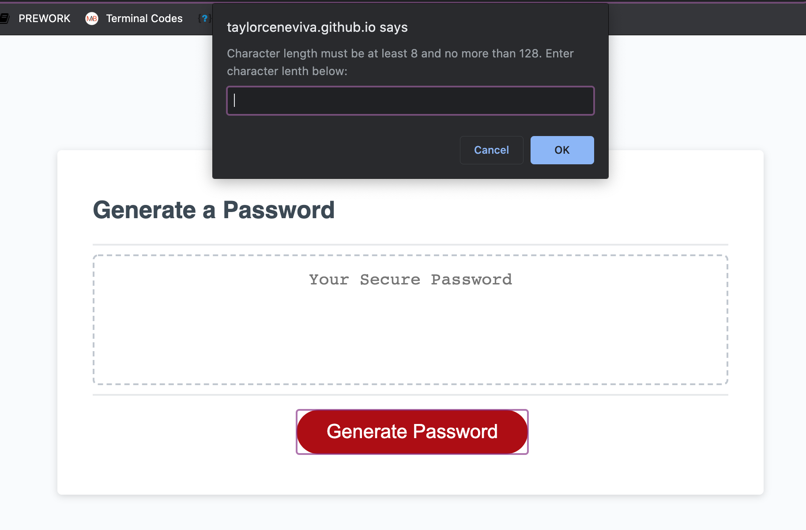
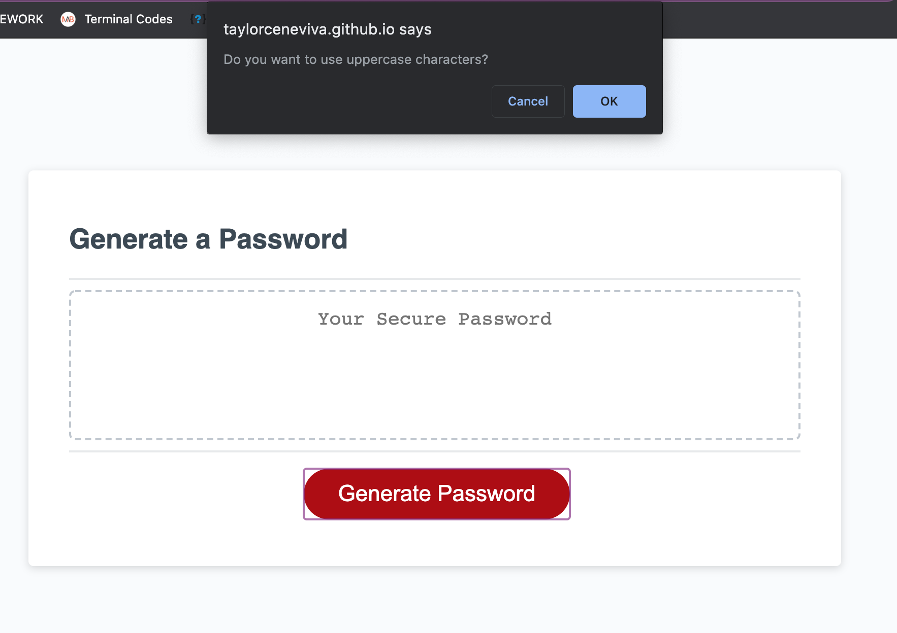
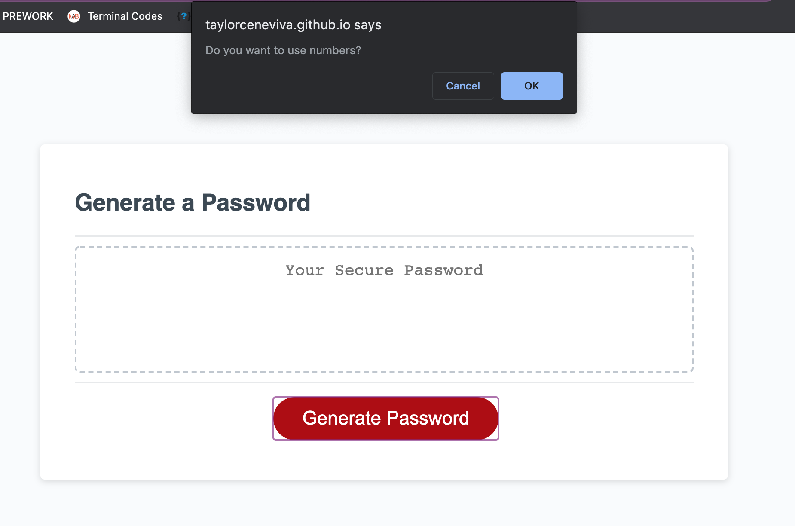
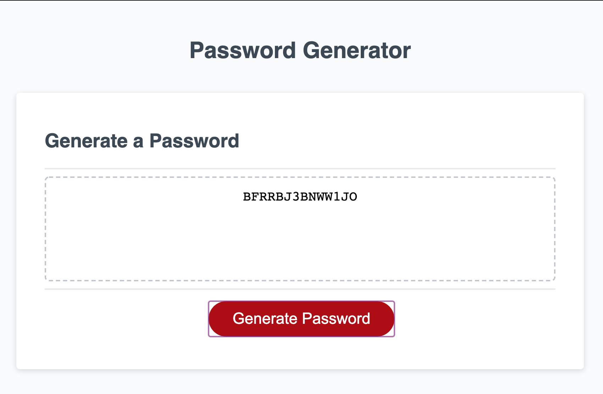

# random-password.generator

## User Story 
The goal of this project was to create a random password generator based on user choices.

## Web Demo

1. First the user will be promted to answer what character length they would like their password to be.

 

2. Then the users will be able to chose whether or not they would like their password to contain uppercase, lowecase, special characters, and/or numbers. 

3. Once promts are confirmed or denyed, a random password will be generated.

## Applications used 
Visual Studio Code